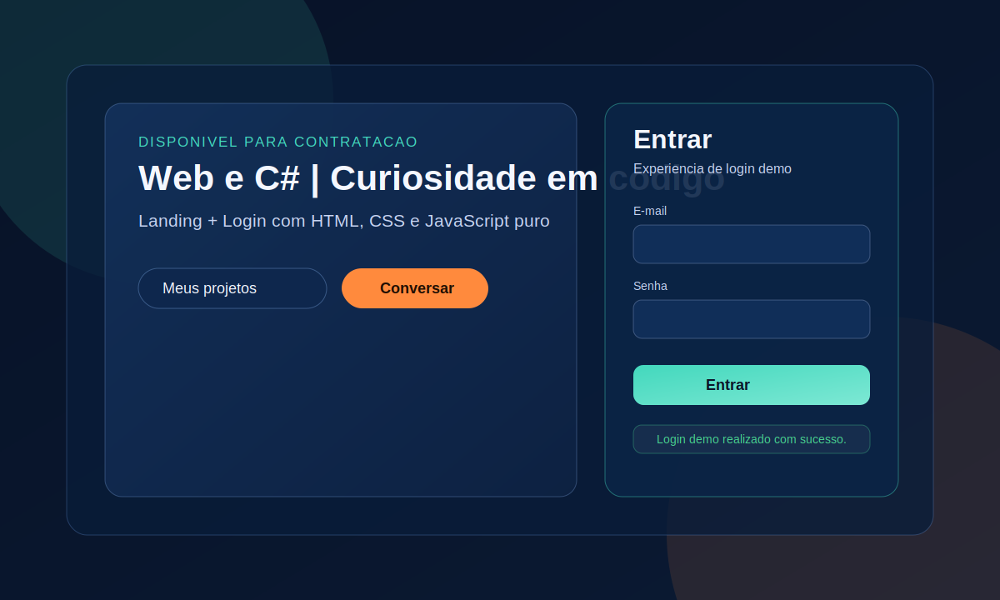
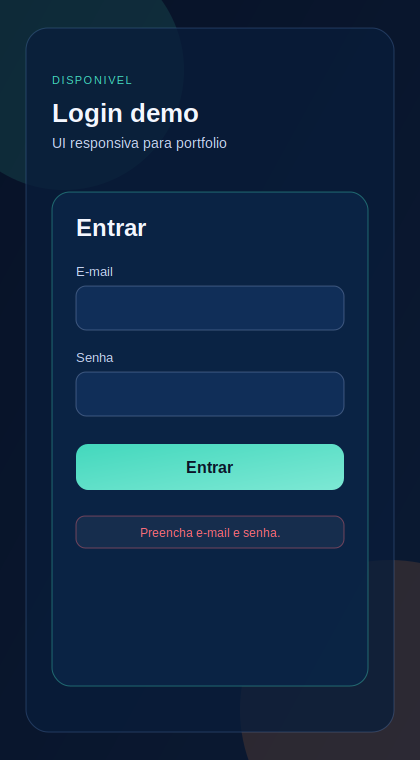

# MARTO | FRONT-END

Pagina de login moderna, responsiva e validada em JavaScript puro.
Projeto criado para demonstrar capacidade tecnica, organizacao de codigo e cuidado com experiencia do usuario.

[Ver projetos no GitHub](https://github.com/martoXm) | [Falar por e-mail](mailto:gabriel.martorelli@hotmail.com)

---

## Preview do projeto

### Versao Desktop

### Versao Mobile

---

## Por que este projeto importa para uma vaga de estagio

Este projeto foi construido para provar fundamentos que empresas esperam de um estagiario com potencial de crescimento:

- Estrutura semantica em HTML com foco em acessibilidade.
- CSS organizado com variaveis globais e padrao de design consistente.
- Layout responsivo para desktop e mobile.
- Validacao de formulario com JavaScript sem dependencia de framework.
- Feedback visual de erro e sucesso para melhorar a usabilidade.
- Separacao clara de responsabilidades entre estrutura, estilo e logica.

---

## Tecnologias aplicadas

- HTML5
- CSS3
- JavaScript

---

## O que foi implementado

### Interface

- Hero de apresentacao profissional.
- Bloco de login com visual moderno e legivel.
- Botoes de acao para portfolio e contato.
- Hierarquia visual pensada para leitura rapida de recrutadores.

### Experiencia do usuario

- Mensagens de validacao objetivas.
- Estados visuais de erro e sucesso.
- Campos com foco destacado para melhor navegacao.
- Adaptacao para telas menores via media queries.

### Logica de validacao

- Bloqueio do envio padrao do formulario para tratar validacao no front-end.
- Verificacao de campos obrigatorios.
- Verificacao basica de formato de e-mail.
- Verificacao de tamanho minimo da senha.

---

## Estrutura do projeto

- index.html: estrutura da pagina.
- style.css: tema, layout, componentes e responsividade.
- script.js: validacoes de formulario e feedback de status.
- DOCUMENTACAO_ESTUDOS.md: explicacao detalhada para revisao e aprendizado continuo.

---

## Como executar localmente

1. Baixe ou clone este repositorio.
2. Abra a pasta no VS Code.
3. Abra o arquivo index.html no navegador.

Nao e necessario instalar dependencias.

---

## Competencias demonstradas

- Desenvolvimento front-end com base solida.
- Organizacao de projeto para manutencao futura.
- Boas praticas iniciais de acessibilidade.
- Capacidade de transformar requisito simples em experiencia visual profissional.
- Comunicacao tecnica clara por meio de documentacao.

---

## Objetivo profissional

Busco oportunidade de estagio em desenvolvimento para evoluir em ambiente colaborativo, contribuir com entregas reais e crescer em front-end e back-end com C#.

Se sua equipe busca alguem com energia para aprender rapido, boa base tecnica e vontade de construir produto com qualidade, vamos conversar.

[Entrar em contato](mailto:gabriel.martorelli@hotmail.com)
